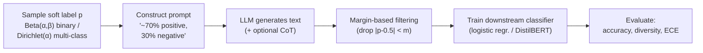

# SoftPrompt: Controllable Zero-Shot Text Generation via Soft Label Conditioning

> Master's thesis, Korea University (Digital Business, Aug 2025) · Submitted to **NeurIPS 2025**
> (rejected after rebuttal; see [`docs/rebuttal_summary.md`](docs/rebuttal_summary.md))
>
> Thesis PDF: *[link TBD]* · Advisor: Prof. Hyungu Kahng

Most LLM-based synthetic data generation conditions the model on a **hard label** —
"write a positive review." This project asks what happens if you condition on a
**soft label** instead — "write a review that is 70% positive, 30% negative" — sampled
from a continuous distribution rather than picked from a fixed set of classes.

**TL;DR:** data generated with soft labels produces better downstream classifiers,
more diverse text, and (when trained on directly, without collapsing to a hard label)
substantially better-calibrated models than the conventional hard-label approach —
across 5 text classification benchmarks, with the effect confirmed to transfer across
3 different generator LLMs.

## How it works


*HardPrompt (top) conditions the LLM on a discrete class label. SoftPrompt (bottom)
samples a continuous probability from a label distribution and conditions the LLM on
that mixture instead — enabling the nuanced, in-between examples a hard label can't
express.*

<details>
<summary>Full pipeline (click to expand)</summary>



</details>

## Key results

*Full experimental setup and analysis: thesis Chapter 4 (5 datasets, 6 data-size
ratios, 50 bootstrap trials each). Numbers below are representative highlights at
r=100% synthetic data.*

**1. Downstream accuracy, SoftPrompt+CoT vs. HardPrompt+CoT vs. Gold**

| Dataset | Gold | HardPrompt+CoT | SoftPrompt+CoT |
|---|---|---|---|
| IMDb | 94.1 | 82.5 | **89.3** |
| SST | 87.3 | **81.5** | 77.5 (→ **84.9** after margin filtering) |
| SUBJ | 96.2 | 59.5 | 67.9 (→ **81.1** after margin filtering) |
| Emotion (macro F1) | 74.9 | 26.7 | **41.2** |
| AGNews | 91.7 | **72.0** | 67.1 |

SoftPrompt wins outright on 3/5 datasets, and on the remaining two (SST, AGNews),
margin-based filtering (below) either closes the gap or flips it entirely.

**2. Margin-based filtering removes the noisiest examples**

The soft label itself provides a natural noise signal: examples prompted near the
decision boundary (p ≈ 0.5) turn out to be the ones the LLM is least faithful to (see
the U-shaped fidelity curve in the [rebuttal summary](docs/rebuttal_summary.md#4-generation-fidelity-analysis-reviewer-fd9a)).
Dropping them before training is a large, free win:

| Dataset (r=100%, +CoT) | Unfiltered | Best margin |
|---|---|---|
| SUBJ | 69.9 | **83.9** (m=0.20) |
| IMDb | 89.3 | **91.8** (m=0.25) |
| SST | 77.5 | **84.9** (m=0.30) |

**3. Training on soft targets directly improves calibration**

Instead of collapsing the soft label to a one-hot target, training with a KL-divergence
loss against the full probability vector:

| Dataset | Target | Accuracy / F1 | ECE ↓ |
|---|---|---|---|
| SUBJ | binarized | 69.9 | 28.6 |
| SUBJ | **soft** | **76.2** | **7.3** |
| Emotion | binarized | 41.2 | 17.3 |
| Emotion | **soft** | **44.7** | **6.8** |

## NeurIPS 2025 rebuttal extensions

The rebuttal period added five substantial new experiments beyond the thesis:
integration with the **ProGen** feedback framework, a **DistilBERT+LoRA** finetuning
evaluation protocol (in addition to the thesis's linear probe), a **cross-LLM**
sensitivity check (GPT-4o-mini, Claude 3 Haiku), a formal **generation-fidelity**
analysis (Pearson correlation + bin-wise MAE, revealing a U-shaped error curve around
the ambiguous 0.5 boundary), and a **HardGen-SoftLabel ablation** that isolates
*when* the soft label needs to enter the pipeline. Full write-up:
[`docs/rebuttal_summary.md`](docs/rebuttal_summary.md); code in [`rebuttal/`](rebuttal/).

## Repository structure

```
softprompt-controllable-generation/
├── softprompt/              # Core thesis-era package
│   ├── runs/                #   generate.py, generate_multi.py (SoftPrompt/HardPrompt
│   │                         #   generation), evaluate_pytorch.py (margin filtering +
│   │                         #   KL-divergence soft-target training + ECE), get_embeddings.py
│   ├── templates/           #   Per-dataset prompt templates (imdb, sst, subj, emotion, agnews)
│   ├── schemas/              #   Pydantic structured-output schemas
│   ├── metrics/              #   ECE, diversity (vocab size, distinct n-grams, embedding similarity)
│   ├── datasets/              #   Oracle/synthetic data loaders
│   ├── algorithms/            #   sklearn logistic regression wrapper
│   └── utils/                  #   LangChain routing, logging, argparse helpers
├── rebuttal/                 # NeurIPS 2025 rebuttal-era additions (see docs/rebuttal_summary.md)
│   ├── finetune.py            #   DistilBERT+LoRA evaluation protocol
│   ├── fidelity_judges/       #   Gold-trained & LLM-as-judge fidelity analysis
│   └── baselines/progen/      #   ProGen integration
├── notebooks/                 # Per-dataset preprocessing / oracle baselines / evaluation /
│                                #   diversity notebooks, + margin-filtering figure generator
│                                #   and Dirichlet-strategy justification (emotion)
├── examples/                  # Real generation samples (SoftPrompt+CoT), one per dataset
├── data/imdb/                  # Small oracle data sample (IMDb; other datasets stream from HF)
├── results/                    # Result tables/figures (see note below)
└── docs/rebuttal_summary.md    # NeurIPS 2025 rebuttal write-up
```

## Setup

```bash
conda create -n softprompt python=3.11
conda activate softprompt
pip install -r requirements.txt
```

Create a `.env` with `OPENAI_API_KEY`, `GOOGLE_API_KEY`, and (for the rebuttal's
cross-LLM experiment) `ANTHROPIC_API_KEY`.

## Usage

```bash
# Generate synthetic data (binary task, soft labels + chain-of-thought)
python softprompt/runs/generate.py --data imdb --sample_size 25000 \
    --output_dir results --batch_size 50 --cot

# Multi-class generation (Dirichlet-sampled labels)
python softprompt/runs/generate_multi.py --data emotion --sample_size 16000 \
    --output_dir results --strategy "very spiky" --batch_size 50 --cot

# Train + evaluate a downstream classifier, with margin filtering and soft-target training
python softprompt/runs/evaluate_pytorch.py --data subj \
    --synthetic_data_dir results/subj/<run> --margin 0.20 --device cuda

# (rebuttal) Finetune DistilBERT+LoRA on synthetic data instead of a linear probe
python rebuttal/finetune.py --data imdb \
    --synthetic_data_folder results/imdb/<run> --model_id distilbert-base-uncased --use_lora
```

Each run writes to `results/{dataset}/{model}/{timestamp}/` with its config, logs, and
a `data.jsonl` of generated (text, soft-label) pairs — see [`examples/`](examples/) for
real, truncated samples from each dataset. The full `results/` and `data/` trees used
for the thesis's actual reported numbers are not tracked here; see
`results/tables/` for the summarized figures reproduced above.

## Notes on scope

This repository reflects the **thesis-era codebase** (`softprompt/`) plus the
**NeurIPS 2025 rebuttal additions** (`rebuttal/`) described above. It does not include
later, unrelated follow-up work (e.g. a subsequent ICLR resubmission, multi-attribute
generation, additional baseline reimplementations, or additional datasets) that was
developed in the same working repository after this project's scope was complete.

## Acknowledgments

Advisor: Prof. Hyungu Kahng (Korea University). Thesis committee: Prof. Hyungu Kahng
(chair), 유재현, 윤태섭.
<!-- TODO(Jimin): replace with committee members' preferred English name spelling -->

